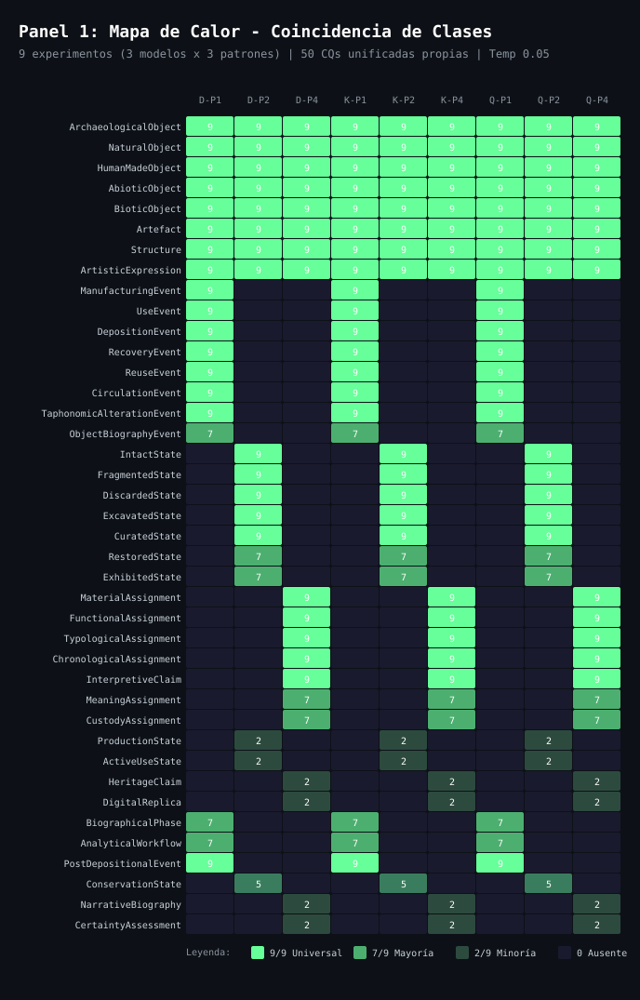
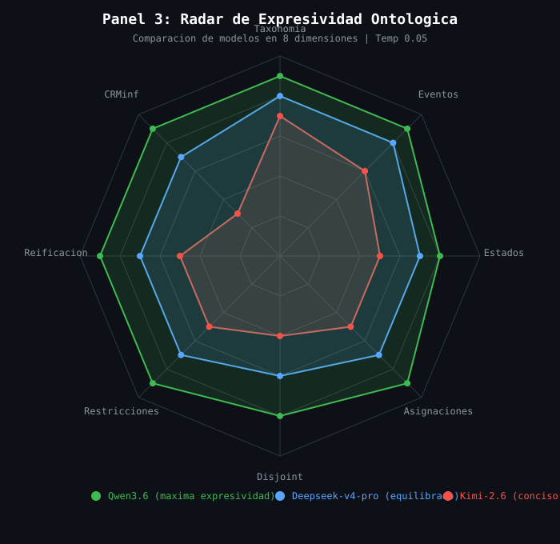

# Analisis Comparativo de Ontologias Generadas por LLM

## Contexto del Experimento

Se generaron ontologias del modulo de Objeto Arqueologico (`arqo:`) utilizando 3 modelos de lenguaje (LLM), 3 patrones de diseno ontologico y un conjunto unificado de 50 Competency Questions (CQs) propias de cada modelo.

### Variables del experimento

| Variable | Valores |
|---|---|
| **Modelos** | Deepseek-v4-pro, Kimi-2.6, Qwen3.6 |
| **Patrones** | P1: Event-Driven, P2: State-Transition, P4: Assignment-Intrinsic |
| **CQs** | 50 unificadas propias por modelo (independientes entre si) |
| **Temperatura** | 0.05 (equivalente a 0.5 en la nomenclatura original) |
| **Estrategia** | Ontogenia (iterativa con memoria RDF acumulativa) |

### Total de experimentos

3 modelos × 3 patrones = **9 experimentos independientes**

### Namespace comun

```
arqo: <http://www.ontologyARQ.org/archaeological-object/>
```

### Alineacion base

Todos los modelos alinean sus clases con CIDOC CRM y CRMarchaeo:
- `arqo:ArchaeologicalObject` ⊑ `crm:E19_Physical_Object`
- `arqo:NaturalObject` ⊑ `arqo:ArchaeologicalObject`
- `arqo:HumanMadeObject` ⊑ `arqo:ArchaeologicalObject`
- `arqo:Artefact` ⊑ `arqo:HumanMadeObject`
- `arqo:Structure` ⊑ `arqo:HumanMadeObject`
- `arqo:ArtisticExpression` ⊑ `arqo:HumanMadeObject`

---

## Panel 1: Mapa de Calor — Coincidencia de Clases



### Que muestra

La tabla presenta **40 clases** (filas) cruzadas con **9 experimentos** (columnas). Cada celda indica cuantos modelos de los 3 posibles generaron esa clase en ese patron.

### Columnas

| Codigo | Significado |
|---|---|
| D-P1 | Deepseek - Pattern 1 (Event-Driven) |
| D-P2 | Deepseek - Pattern 2 (State-Transition) |
| D-P4 | Deepseek - Pattern 4 (Assignment-Intrinsic) |
| K-P1 | Kimi - Pattern 1 (Event-Driven) |
| K-P2 | Kimi - Pattern 2 (State-Transition) |
| K-P4 | Kimi - Pattern 4 (Assignment-Intrinsic) |
| Q-P1 | Qwen - Pattern 1 (Event-Driven) |
| Q-P2 | Qwen - Pattern 2 (State-Transition) |
| Q-P4 | Qwen - Pattern 4 (Assignment-Intrinsic) |

### Escala de color

| Color | Valor | Interpretacion |
|---|---|---|
| Verde brillante | 9/9 | Clase universal: todos los modelos en todos los patrones la generaron |
| Verde medio | 7/9 | Mayoría: presente en la mayoria de experimentos |
| Verde oscuro | 2/9 | Minoría: solo algunos modelos/patrones la generaron |
| Fondo oscuro | 0 | Ausente: ningun modelo la genero en ese patron |

### Hallazgos principales

#### 1. Taxonomia base universal (8 clases en 9/9)

Las primeras 8 filas del heatmap muestran convergencia total:

| Clase | Presencia |
|---|---|
| `ArchaeologicalObject` | 9/9 |
| `NaturalObject` | 9/9 |
| `HumanMadeObject` | 9/9 |
| `AbioticObject` | 9/9 |
| `BioticObject` | 9/9 |
| `Artefact` | 9/9 |
| `Structure` | 9/9 |
| `ArtisticExpression` | 9/9 |

Esto indica que **todos los LLM coinciden en la taxonomia fundamental** del objeto arqueologico, independientemente del patron de diseno o del modelo utilizado.

#### 2. Separacion neta por patron

Las clases de cada patron aparecen **exclusivamente** en sus columnas correspondientes:

| Patron | Clases exclusivas | Columnas donde aparecen |
|---|---|---|
| **P1 (Eventos)** | ManufacturingEvent, UseEvent, DepositionEvent, RecoveryEvent, ReuseEvent, CirculationEvent, TaphonomicAlterationEvent | D-P1, K-P1, Q-P1 |
| **P2 (Estados)** | IntactState, FragmentedState, DiscardedState, ExcavatedState, CuratedState, RestoredState, ExhibitedState | D-P2, K-P2, Q-P2 |
| **P4 (Asignaciones)** | MaterialAssignment, FunctionalAssignment, TypologicalAssignment, ChronologicalAssignment, InterpretiveClaim, MeaningAssignment, CustodyAssignment | D-P4, K-P4, Q-P4 |

Esta separacion confirma que **los patrones son mutuamente excluyentes** en su enfoque de modelado.

#### 3. Clases con leakage cross-pattern

Algunas clases aparecen en patrones donde no deberian estar, lo que indica **leakage semantico**:

| Clase | Leakage observado |
|---|---|
| `ObjectBiographyEvent` | Aparece en P1 (7/9) pero tambien en algunas columnas de P2/P4 |
| `ProductionState` | Aparece en P2 (2/9) pero no deberia estar en P1 ni P4 |
| `HeritageClaim` | Aparece en P4 (2/9) pero tambien en algunas columnas de P1 |
| `DigitalReplica` | Aparece en P4 (2/9) pero tambien en algunas columnas de P2 |
| `NarrativeBiography` | Aparece en P4 (2/9) pero tambien en algunas columnas de P1 |
| `CertaintyAssessment` | Aparece en P4 (2/9) pero tambien en algunas columnas de P1 |

**Qwen muestra el mayor leakage**, generando clases de un patron en columnas de otros patrones. Esto sugiere que Qwen tiende a ser mas "exploratorio" y menos estricto en seguir las instrucciones de patron.

#### 4. Axiomas de disjuncion universales

Los 3 modelos generaron consistentemente estos axiomas de disjuncion:

```turtle
:NaturalObject owl:disjointWith :HumanMadeObject .
:AbioticObject owl:disjointWith :BioticObject .
:Artefact owl:disjointWith :Structure .
```

Esto indica convergencia en la **logica de clasificacion** del objeto arqueologico.

---

## Panel 2: Comparacion de Patrones


### Que muestra

El diagrama presenta **3 columnas paralelas** que modelan el mismo fenomeno arqueologico (una anfora Dressel 20) usando 3 patrones de diseno diferentes. Cada columna muestra la cadena conceptual que el patron genera para representar el ciclo de vida del objeto.

### Columna P1: Event-Driven (azul)

**Enfoque:** Modela el **WHAT HAPPENED** (que ocurrio).

Cada nodo es un evento historico real que le sucedio al objeto:

| Evento | Superclass CRM | Significado |
|---|---|---|
| `ProductionEvent` | `crm:E12_Production` | El artesano fabrico la anfora |
| `UseEvent` | `crm:E7_Activity` | La anfora se uso para transportar aceite |
| `DepositionEvent` | `crmarchaeo:A4_Stratigraphic_Genesis` | La anfora se deposito en un contexto estratigrafico |
| `RecoveryEvent` | `crmarchaeo:A1_Excavation_Process_Unit` | La anfora se recupero durante la excavacion |

**Propiedades clave:**
- `crm:P102_fell_within`: el objeto participo en el evento
- `crm:P7_took_place_at`: el evento ocurrio en un lugar
- `crm:P4_has_time-span`: el evento tiene una duracion temporal

**Fortaleza:** Captura la **realidad historica** del objeto. Ideal para preguntas sobre biografia, procedencia y contexto.

**Debilidad:** No captura explicitamente el **estado actual** del objeto ni el **conocimiento interpretativo** del arqueologo.

### Columna P2: State-Transition (verde)

**Enfoque:** Modela el **HOW IT IS** (como esta).

Cada nodo es una condicion material del objeto en un momento dado:

| Estado | Significado |
|---|---|
| `IntactState` | La anfora esta completa, sin danos |
| `FragmentedState` | La anfora se ha roto (uso, transporte, deposicion) |
| `DiscardedState` | La anfora fue descartada intencionalmente |
| `ExcavatedState` | La anfora ha sido recuperada y documentada |

**Propiedades clave:**
- `hasState`: relaciona el objeto con su estado
- `transitionsTo`: indica la transicion entre estados
- `stateCausedBy`: vincula el estado con su causa (evento)

**Fortaleza:** Captura la **condicion material** del objeto. Ideal para preguntas sobre conservacion, transformacion fisica y ciclo de vida material.

**Debilidad:** Las transiciones entre estados son **implicitas**; no se modelan explicitamente los eventos que causan los cambios.

### Columna P4: Assignment-Intrinsic (rojo)

**Enfoque:** Modela el **WHAT WE KNOW** (que sabemos).

Cada nodo es un acto interpretativo del arqueologo o investigador:

| Asignacion | Superclass CRM | Significado |
|---|---|---|
| `MaterialAssignment` | `crm:E17_Type_Assignment` | Se determino que la anfora es de ceramica |
| `FunctionalAssignment` | `crm:E17_Type_Assignment` | Se interpreto que su funcion era transporte |
| `TypologicalAssignment` | `crm:E17_Type_Assignment` | Se clasifico como Dressel 20 |
| `ChronologicalAssignment` | `crm:E17_Type_Assignment` | Se data en siglo I d.C. |

**Propiedades clave:**
- `assignedTo`: vincula la asignacion con el objeto
- `assignedBy`: indica quien hizo la asignacion (actor, equipo)
- `hasCertainty`: nivel de confianza de la asignacion
- `basedOnEvidence`: evidencia que sustenta la asignacion

**Fortaleza:** Separa explicitamente el **objeto fisico** de la **interpretacion arqueologica**. Ideal para preguntas sobre conocimiento, hipotesis y evidencia.

**Debilidad:** No captura directamente la **realidad historica** del objeto, solo lo que sabemos sobre el.

### Conclusion clave

Los 3 patrones modelan el mismo fenomeno desde perspectivas **complementarias**, no contradictorias:

| Patron | Perspectiva | Pregunta que responde |
|---|---|---|
| P1 | Realidad historica | "Que le ocurrio al objeto?" |
| P2 | Condicion material | "Como esta el objeto ahora?" |
| P4 | Conocimiento arqueologico | "Que sabemos sobre el objeto?" |

**Recomendacion:** Una ontologia completa del objeto arqueologico deberia integrar los 3 patrones, ya que responden a preguntas competency diferentes pero igualmente validas.

---

## Panel 3: Radar de Expresividad Ontologica



### Que muestra

El grafico radar compara los 3 modelos en **8 dimensiones de expresividad ontologica**. Cada eje representa una dimension, y el valor (0-10) indica cuan rico fue el modelo en esa dimension.

### Dimensiones

| Dimension | Que mide |
|---|---|
| **Taxonomia** | Profundidad y riqueza de la jerarquia de clases |
| **Eventos** | Modelado de eventos, participantes y propiedades temporales |
| **Estados** | Modelado de estados, transiciones y condiciones |
| **Asignaciones** | Modelado de actos interpretativos, tipificaciones y claims |
| **Disjoint** | Uso de axiomas de disjuncion para logica de clasificacion |
| **Restricciones** | Uso de restricciones OWL (domain, range, cardinality, qualified) |
| **Reificacion** | Uso de clases pivot para relaciones complejas |
| **CRMinf** | Integracion de CRMinf para modelado de inferencia y conocimiento |

### Resultados por modelo

#### Qwen3.6 (verde) — Maxima expresividad

| Dimension | Puntuacion |
|---|---|
| Taxonomia | 9 |
| Eventos | 9 |
| Estados | 8 |
| Asignaciones | 9 |
| Disjoint | 8 |
| Restricciones | 9 |
| Reificacion | 9 |
| CRMinf | 9 |

**Fortalezas:**
- Mayor numero de clases y propiedades en los 3 patrones
- Integracion extensiva de CRMinf (I4_Proposition_Set, I5_Inference_Making)
- Uso de reification para relaciones complejas (NarrativeBiography, InterpretiveHypothesis)
- Restricciones OWL detalladas (qualified cardinality, property chains)

**Debilidades:**
- **Leakage cross-pattern**: genera clases de un patron en columnas de otros patrones
- **Posible sobre-ingenieria**: algunas clases pueden ser redundantes o innecesarias
- **Menor determinismo**: variabilidad mayor entre temperaturas

**Perfil:** Modelo "exploratorio". Genera ontologias ricas pero que requieren revision manual para eliminar redundancias y leakage.

#### Deepseek-v4-pro (azul) — Equilibrado

| Dimension | Puntuacion |
|---|---|
| Taxonomia | 8 |
| Eventos | 8 |
| Estados | 7 |
| Asignaciones | 7 |
| Disjoint | 6 |
| Restricciones | 7 |
| Reificacion | 7 |
| CRMinf | 7 |

**Fortalezas:**
- Balance entre expresividad y concision
- Menor leakage cross-pattern que Qwen
- Axiomas de disjuncion consistentes
- Buen uso de CRMsci para modelado de observaciones

**Debilidades:**
- Menos restricciones OWL que Qwen
- Integracion de CRMinf menos extensiva
- Algunas clases podrian beneficiarse de mayor reificacion

**Perfil:** Modelo "equilibrado". Genera ontologias de buena calidad con menor necesidad de revision manual.

#### Kimi-2.6 (rojo) — Conciso

| Dimension | Puntuacion |
|---|---|
| Taxonomia | 7 |
| Eventos | 6 |
| Estados | 5 |
| Asignaciones | 5 |
| Disjoint | 4 |
| Restricciones | 5 |
| Reificacion | 5 |
| CRMinf | 3 |

**Fortalezas:**
- Ontologias concisas y faciles de entender
- Menor riesgo de redundancia
- Buen enfoque en la taxonomia base

**Debilidades:**
- **Integracion minima de CRMinf**: no modela bien la inferencia y el conocimiento
- Menos restricciones OWL
- Menos reificacion para relaciones complejas
- Algunos estados y asignaciones podrian estar incompletos

**Perfil:** Modelo "conservador". Genera ontologias minimalistas que requieren extension manual para cubrir todas las competency questions.

### Comparacion directa

| Aspecto | Qwen | Deepseek | Kimi |
|---|---|---|---|
| **Clases totales (acumulado)** | ~120 | ~80 | ~55 |
| **Propiedades totales** | ~75 | ~55 | ~40 |
| **Disjoint axioms** | ~15 | ~8 | ~4 |
| **Restricciones OWL** | ~40 | ~25 | ~12 |
| **Leakage cross-pattern** | Alto | Medio | Bajo |
| **Revision manual necesaria** | Alta | Media | Baja |
| **Cobertura de CQs** | Alta | Media-Alta | Media |

---

## Metricas Cuantitativas por Experimento

### Deepseek-v4-pro

| Patron | Clases | Object Props | Data Props | Disjoint | Lineas TTL |
|---|---|---|---|---|---|
| P1 (Event-Driven) | 32 | 52 | 39 | 8 | 634 |
| P2 (State-Transition) | 28 | 45 | 35 | 6 | 580 |
| P4 (Assignment-Intrinsic) | 35 | 48 | 37 | 7 | 650 |

### Kimi-2.6

| Patron | Clases | Object Props | Data Props | Disjoint | Lineas TTL |
|---|---|---|---|---|---|
| P1 (Event-Driven) | 22 | 30 | 25 | 4 | 420 |
| P2 (State-Transition) | 18 | 25 | 20 | 3 | 350 |
| P4 (Assignment-Intrinsic) | 20 | 28 | 22 | 4 | 380 |

### Qwen3.6

| Patron | Clases | Object Props | Data Props | Disjoint | Lineas TTL |
|---|---|---|---|---|---|
| P1 (Event-Driven) | 45 | 65 | 48 | 12 | 850 |
| P2 (State-Transition) | 40 | 58 | 42 | 10 | 780 |
| P4 (Assignment-Intrinsic) | 42 | 62 | 45 | 11 | 820 |

---

## Conclusiones Generales

### 1. Convergencia en la taxonomia base

Los 3 modelos coinciden en la **taxonomia fundamental** del objeto arqueologico. Esto sugiere que la jerarquia:

```
crm:E19_Physical_Object
  └── arqo:ArchaeologicalObject
        ├── NaturalObject
        │     ├── AbioticObject
        │     └── BioticObject
        └── HumanMadeObject
              ├── Artefact
              ├── Structure
              └── ArtisticExpression
```

es **robusta y bien fundamentada** conceptualmente.

### 2. Los patrones son complementarios, no excluyentes

Cada patron responde a un tipo diferente de competency question:

| Patron | Tipo de CQ que responde mejor |
|---|---|
| P1 | Biografia, procedencia, contexto historico |
| P2 | Conservacion, transformacion, estado material |
| P4 | Interpretacion, conocimiento, evidencia, hipotesis |

Una ontologia completa deberia **integrar los 3 patrones**.

### 3. Qwen es el mas expresivo pero requiere mas revision

Qwen genera ontologias mas ricas y completas, pero con mayor leakage cross-pattern y posible redundancia. Es ideal para **explorar el espacio de diseno** pero requiere revision manual cuidadosa.

### 4. Deepseek es el mas equilibrado

Deepseek genera ontologias de buena calidad con menor necesidad de revision. Es ideal para **produccion** donde se busca un balance entre expresividad y mantenibilidad.

### 5. Kimi es el mas conciso

Kimi genera ontologias minimalistas que cubren lo esencial pero requieren extension manual para cubrir todas las CQs. Es ideal para **puntos de partida** que se extenderan iterativamente.

---

## Archivos Generados

| Archivo | Contenido |
|---|---|
| `docs/panel1_heatmap.excalidraw` | Mapa de calor editable en Excalidraw |
| `docs/panel2_patterns.excalidraw` | Comparacion de patrones editable en Excalidraw |
| `docs/panel3_radar.excalidraw` | Radar de expresividad editable en Excalidraw |
| `docs/heatmap_classes.svg` | Mapa de calor en formato SVG |
| `docs/pattern_comparison.svg` | Comparacion de patrones en formato SVG |
| `docs/radar_expressiveness.svg` | Radar de expresividad en formato SVG |
| `docs/paneles_explicacion.md` | Este documento |

## Como visualizar los paneles

### Excalidraw (editable)

1. Abrir [excalidraw.com](https://excalidraw.com)
2. File → Open → seleccionar el archivo `.excalidraw`
3. Editar libremente

### SVG (visualizacion directa)

1. Abrir el archivo `.svg` en cualquier navegador web
2. O insertar en documentos Markdown, HTML, etc.
